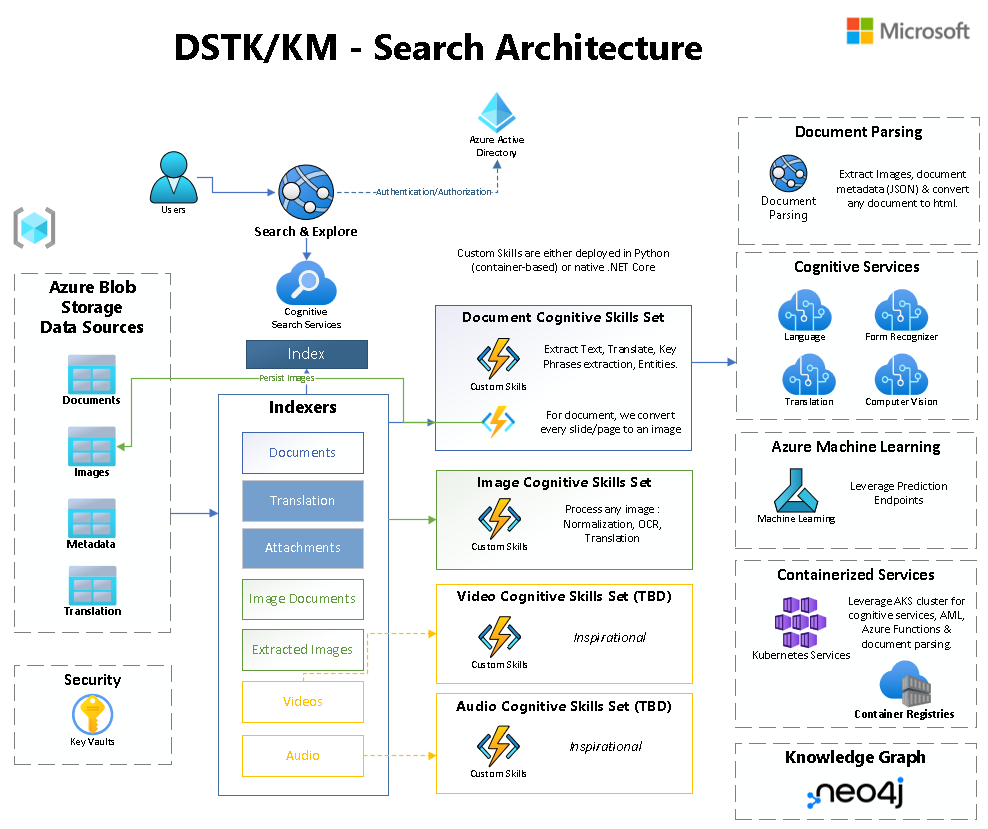
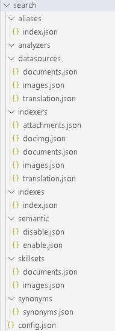
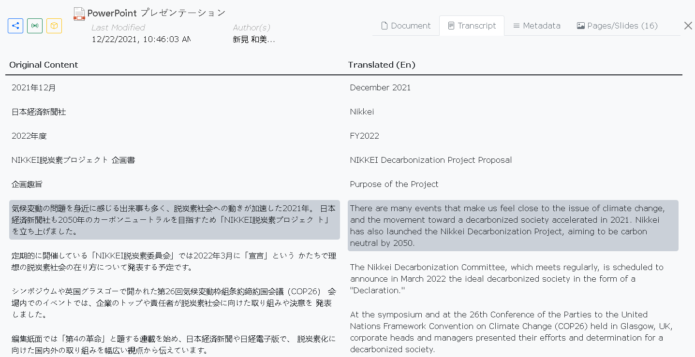
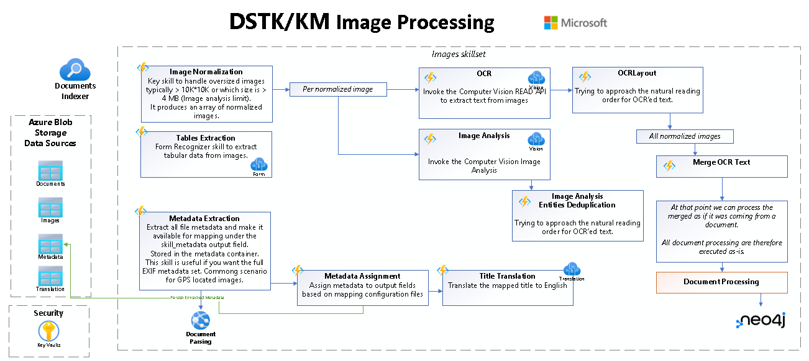
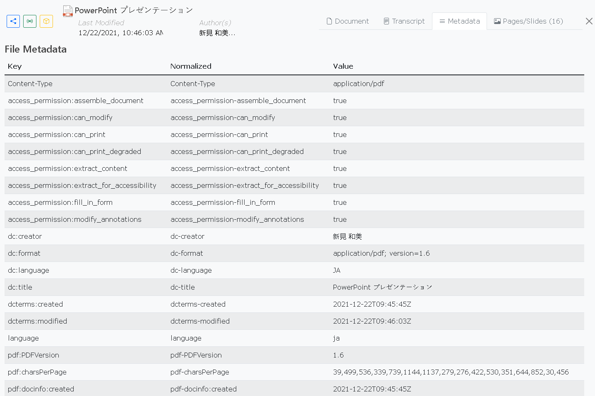

# Azure Cognitive Search (ACS)

ACS is at the core of this Knowledge Mining accelerator. It provides the necessary search and exploration features to the solution. 

# Architecture 



# Ingestion

The solacc is configured to ingest data from an Azure Storage Data Lake.

to pick up content from the documents container. 

# Search Configuration

All search configuration is JSON-based organized in folders



Adding a new search index or datasource is as simple as dropping a new JSON file in the corresponding folder and run the following. 

```ps
cd deployment
./init_env.ps1 -Name <envid>
Initialize-Search
```

Initialize-Search will re-apply all existing configurations. If you need targeted updates, please refer to the below commands 

- Update-SearchAliases
- Update-SearchDataSource                          
- Update-SearchIndex
- Update-SearchIndexer
- Update-SearchSkillSet
- Update-SearchSynonyms                              


# Enrichment concepts  

## Use of Apache Tika 2.x

Apache Tika 2.x provides great content analysis capabilities like : 

- Supports a wide range of [document formats](https://tika.apache.org/2.4.0/formats.html) 
- Extract Metadata
- HTML Conversion
- Text Extraction
- Extract Table of Contents, Annotations (PDF)
- Images Extraction

[and more...](https://tika.apache.org/)

We use a custom version of Tika to natively support Azure Storage to ease data transit and processing. 

## Extracting images from documents (Tika-based)

The technology we use to extract images from documents is provide by a custom Apache Tika version. 

While Tika can extract embedded images from any Office or PDF documents, in practice it leads to have many images not giving much value i.e. logos, backgrounds etc. 

Also annotations overlapping images in documents or any graphical element are lost. This is mostly seen & common in PDF. 

For this solution, by default, we chose to extract 
- each PowerPoint slide into an image
- each PDF page into an image

Each image is then indexed as an individual item allowing end-users to target & retrieve specific slide or page. You don't have to scroll any big PDF to find where your search query was matched.  

This choice too provides more user experience capabilities like document cover, thumbnails or tables extraction.  

There is another aspect of doing your own images extraction is cost. In Azure Cognitive Search, Images extraction is [a paid feature.](https://azure.microsoft.com/en-us/pricing/details/search/)


## Translation

Each textual content whether it is coming from the text extraction of a full document or the OCR outcome of an image is translated to English. 

On non-native English documents, the Transcript tab  will show a side-by-side translation. 




## Document Processing 

The below diagram highlights the document processing flow. 


Out of processing a document it produces images (pages/slides) 

## Image Processing

The below diagram highlights the image processing flow. Note that once the text of an image is extracted the same document processing will apply against it.   



## Audio & Video

You may extend the solution to include Audio and Videos processing. 

# Azure Cognitive Search Skills

Below the list of custom functions supporting skills

| Skill | Description | Language | 
| ------------- | ----------- | ----------- | 
| Entities | Utility skill to deduplicate, clean, concatenate entities | C# |
| Geo | Skill to assign a country, city, capital & other locations from a list of locations | C# |
| Image/Extraction| Skill to trigger the images extraction on documents | C# |
| Language | Single Skills to interact with Azure Cognitive Services Language : TextAnalytics, Translator| Python |
| Metadata/Assign | Skill to combine all metadata assignments in terms of metadata, security or anything you'd want.| C# |
| Metadata/Extraction | ACS provide a set of common properties for any file. This skill will provide you with the entire set of metadata a file has. It is based on Apache Tika| C# |
| Text | Skill to manipulate textual data|  C# |
| Vision | Single Skills to interact with Azure Cognitive Services Vision : Analyze, Computer Vision, Form Recognizer|  Python |

To support some content analysis skills like Image & Metadata extraction, we deploy a docker-based Tika server.
The container service we used is Azure App Service. For Production use, we would recommend Azure Kubernetes.

A function could host one or more skills. 

## Entities Function App

There are 3 skills within the Entities function.  

- Concatenate (currently not used)
- Deduplication
- KeyPhrasesCleansing

During document processing, limitations on the number of characters certain Cognitive Services accept, textual content is therefore split into pages. 

Each page is then processed separately causing Named Entities Recognition or Key Phrases extraction to potential output the same entities across multiple pages. 

### Concatenate

Currently not used. 

### Deduplication

This skill is responsible to deduplicate all extracted NER across pages. 

_Skill definition_
```json
        {
            "@odata.type": "#Microsoft.Skills.Custom.WebApiSkill",
            "name": "EntitiesDeduplication",
            "description": "A custom skill to normalize and deduplicate values of entities.",
            "context": "/document",
            "uri": "{{param.entities.deduplication}}",
            "httpMethod": "POST",
            "timeout": "PT30S",
            "batchSize": 1,
            "degreeOfParallelism": null,
            "inputs": [
                {
                    "name": "keyPhrases",
                    "source": "/document/pages/*/raw_keyPhrases/*",
                    "sourceContext": null,
                    "inputs": []
                },
                {
                    "name": "organizations",
                    "source": "/document/pages/*/raw_organizations/*",
                    "sourceContext": null,
                    "inputs": []
                },
                {
                    "name": "locations",
                    "source": "/document/pages/*/raw_locations/*",
                    "sourceContext": null,
                    "inputs": []
                },
                {
                    "name": "persons",
                    "source": "/document/pages/*/raw_persons/*",
                    "sourceContext": null,
                    "inputs": []
                }
            ],
            "outputs": [
                {
                    "name": "keyPhrases",
                    "targetName": "dedup_keyPhrases"
                },
                {
                    "name": "organizations",
                    "targetName": "organizations"
                },
                {
                    "name": "locations",
                    "targetName": "temp_locations"
                },
                {
                    "name": "persons",
                    "targetName": "persons"
                }
            ],
            "httpHeaders": {}
        },
```

### KeyPhrases Cleansing 

Key Phrases produces a lot of noise (unsupervised effect) wich may collide with NER : some key phrases entries could be seen in locations already. 

This skill removes collision between KP and NER 

_Skill definition_
```json
        {
            "@odata.type": "#Microsoft.Skills.Custom.WebApiSkill",
            "name": "#14",
            "description": "A custom skill to remove stopwords from keyphrases vs others entities",
            "context": "/document",
            "uri": "{{param.entities.keyphrases-cleansing}}",
            "httpMethod": "POST",
            "timeout": "PT30S",
            "batchSize": 1,
            "degreeOfParallelism": null,
            "inputs": [
                {
                    "name": "keyPhrases",
                    "source": "/document/dedup_keyPhrases",
                    "sourceContext": null,
                    "inputs": []
                },
                {
                    "name": "organizations",
                    "source": "/document/organizations",
                    "sourceContext": null,
                    "inputs": []
                },
                {
                    "name": "locations",
                    "source": "/document/locations",
                    "sourceContext": null,
                    "inputs": []
                },
                {
                    "name": "persons",
                    "source": "/document/persons",
                    "sourceContext": null,
                    "inputs": []
                }
            ],
            "outputs": [
                {
                    "name": "keyPhrases",
                    "targetName": "keyPhrases"
                },
                {
                    "name": "acronyms",
                    "targetName": "acronyms"
                }
            ],
            "httpHeaders": {}
        },
```

**Note** Acronyms is a placeHolder if you wish to create or look up Acronyms.

Examples

- Creation scenario: If you have a key phrase "Department of Justice" you could output an acronym DoJ.
- Look up : Find an acronym in key phrases, look it up in your acronyms referential and add its defintion to key phrases. 


## Geo Function App 

### GeoLocations Skill

A very simple Geo location function/skill, to assign countries, capitals, cities and other locations. Such skill supports the Maps vertical experience.

Why? 

Named Entities Recognition will produce a set of locations with more or less granularity

(Supported Named Entity Recognition (NER) entity categories)[https://docs.microsoft.com/en-us/azure/cognitive-services/language-service/named-entity-recognition/concepts/named-entity-categories#category-location]

The skill will take the produced NER locations, identify known capitals and countries and assign them to differents search fields. 

This is a very simple approach to enable geo-locations in your solution. 

_Skill definition_
```json
        {
            "@odata.type": "#Microsoft.Skills.Custom.WebApiSkill",
            "name": "geolocations",
            "description": "Locations geo locations for the map support",
            "context": "/document",
            "uri": "{{param.geolocations.locations}}",
            "httpMethod": "POST",
            "timeout": "PT1M",
            "batchSize": 5,
            "degreeOfParallelism": null,
            "inputs": [
                {
                    "name": "locations",
                    "source": "/document/temp_locations"
                }
            ],
            "outputs": [
                {
                    "name": "locations",
                    "targetName": "locations"
                },
                {
                    "name": "countries",
                    "targetName": "countries"
                },
                {
                    "name": "capitals",
                    "targetName": "capitals"
                },
                {
                    "name": "cities",
                    "targetName": "cities"
                }
            ],
            "httpHeaders": {}
        },
```

## Image Extraction

Image Extraction is the only Durable function of all our skills so it doesn't affect the processing of documents. 

_Skill definition_
```json
        {
            "@odata.type": "#Microsoft.Skills.Custom.WebApiSkill",
            "name": "ImageExtraction",
            "description": "Send the document references for Images extraction (TIKA)",
            "context": "/document",
            "uri": "{{param.imgext.DurableImageExtractionSkill_HttpStart}}",
            "httpMethod": "POST",
            "timeout": "PT30S",
            "batchSize": 1,
            "degreeOfParallelism": 5,
            "inputs": [
                {
                    "name": "document_index_key",
                    "source": "/document/index_key"
                },
                {
                    "name": "document_id",
                    "source": "/document/document_id"
                },
                {
                    "name": "document_filename",
                    "source": "/document/document_filename"
                },
                {
                    "name": "document_url",
                    "source": "/document/document_url"
                },
                {
                    "name": "document_metadata",
                    "source": "/document/skill_metadata"
                }
            ],
            "outputs": [
                {
                    "name": "message",
                    "targetName": "image_extraction_message"
                }
            ],
            "httpHeaders": {}
        },
```

## Language

This function holds multiple skills related to Azure Cognitive Language service. 

Please refer the function [README](../../src/CognitiveSearch.Skills/Python/Language/README.md) for more details. 


## Metadata Assign Function App 

A single skill function app. 

### Assign Skill

Another important skill in our solution aimed to provide a place to map file metadata, assign default values, security groups to content and more...

_Skill definition_
```json
        {
            "@odata.type": "#Microsoft.Skills.Custom.WebApiSkill",
            "name": "MetadataAssignment",
            "context": "/document",
            "uri": "{{param.mtda.Assign}}",
            "httpMethod": "POST",
            "timeout": "PT1M",
            "batchSize": 5,
            "degreeOfParallelism": null,
            "inputs": [
                {
                    "name": "document_filename",
                    "source": "/document/document_filename"
                },
                {
                    "name": "document_url",
                    "source": "/document/document_url"
                },
                {
                    "name": "file_metadata",
                    "source": "/document/file_metadata"
                },
                {
                    "name": "author",
                    "source": "/document/metadata_author"
                },
                {
                    "name": "metadata_title",
                    "source": "/document/metadata_title"
                },
                {
                    "name": "metadata_last_modified",
                    "source": "/document/metadata_last_modified"
                },
                {
                    "name": "metadata_creation_date",
                    "source": "/document/metadata_creation_date"
                }
            ],
            "outputs": [
                {
                    "name": "skill_metadata",
                    "targetName": "skill_metadata"
                }
            ],
            "httpHeaders": {}
        },
```

### Metadata Mapping 

This metadata mapping feature is allowing you to map any document metadata **source** to any search enrichment fields **target**. 

Important in order to simplify the mapping entries, the source entries are normalized : blank space and semi-column are replaced by dash. 

```C#
key.Replace(" ","-").Replace(":","-")
```

Examples
```
dcterms:modified => dcterms-modified 
```

The mapping is evaluated sequentially, so you can handle overwriting a target field. See the last_modified 

```json
[
  {
    "source": "dcterms-created",
    "target": [ "creation_date", "last_modified", "last_save_date" ]
  },
  {
    "source": "dcterms-modified",
    "target": [ "last_modified" ]
  },
  {
    "source": "meta-save-date",
    "target": [ "last_save_date" ]
  },
  {
    "source": "dc-subject",
    "target": [ "description" ]
  },
  {
    "source": "Category",
    "target": [ "user_categories" ],
    "transform": "SplitSemiColumn"
  },
  {
    "source": "meta-author",
    "target": [ "authors" ],
    "transform": "none"
  },
  {
    "source": "meta-last-author",
    "target": [ "authors" ],
    "transform": "none"
  },
  {
    "source": "meta-keyword",
    "target": [ "user_keywords" ],
    "transform": "SplitSemiColumn"
  },
  {
    "source": "custom-Tags",
    "target": [ "user_tags" ],
    "transform": "SplitSPTaxonomy"
  },
  {
    "source": "custom-Document-Type",
    "target": [ "user_tags" ],
    "transform": "SplitSPTaxonomy"
  }
]
```

**Note**: You may extend the metadata mapping to capture [EXIF tags](https://en.wikipedia.org/wiki/Exif) i.e. GPS latitude, lontitude or Altitude or [XMP tags](https://en.wikipedia.org/wiki/Extensible_Metadata_Platform).

EXIF/XMP metadata are extracted by Apache Tika hence available for mapping ! 

To help refining your mapping, the document details Metadata 


### Content Security 

This is an important configuration to allow you to secure content based on location. The target are referencing Azure AD Groups (GUID). 

```json
[
  {
    "source": [ "folder1", "restricted" ],
    "target": [ "group1" ]
  },
  {
    "source": [ "folder2" , "restricted"],
    "target": [ "group2" ]
  },
  {
    "source": [ "folder3", "restricted" ],
    "target": [ "group3" ]
  }
]
```

In the above example, any content with folder1 and restricted part of their storage path will be secured with group1. Ans so on.

To assign a group, all source partial path have to match (AND). 

Groups are stored in the search index under the permissions field (list of AAD Guid).

### Content Group

```json
[
  {
    "source": [ "folder1"],
    "target": "Group1 Data"
  },
  {
    "source": [ "folder2"],
    "target": "Group2 Data"
  },
  {
    "source": [ "folder3"],
    "target": "Group3 Data"
  }
]
```

Content group follows the same framework as content security, it provides you an ability to logically group scattered data in a content_group facetable index field. 


## Text Function App

The function app contains multiple functions but only 3 are currently in use

- HTMLConversion
- TextMesh
- TranslationMerge

### HTML Conversion skill 

_Skill definition_
```json
        {
            "@odata.type": "#Microsoft.Skills.Custom.WebApiSkill",
            "name": "HTMLConversion",
            "description": "Send the document references for HTML Conversion extraction (TIKA)",
            "context": "/document",
            "uri": "{{param.text.HtmlConversion}}",
            "httpMethod": "POST",
            "timeout": "PT3M",
            "batchSize": 1,
            "degreeOfParallelism": 1,
            "inputs": [
                {
                    "name": "document_index_key",
                    "source": "/document/index_key"
                },
                {
                    "name": "document_id",
                    "source": "/document/document_id"
                },
                {
                    "name": "document_filename",
                    "source": "/document/document_filename"
                },
                {
                    "name": "document_url",
                    "source": "/document/document_url"
                }
            ],
            "outputs": [
                {
                    "name": "file_html",
                    "targetName": "file_html"
                }
            ],
            "httpHeaders": {}
        },
```


### TextMesh

This skill does a cleanup any input text like removing empty lines. It condenses the text to its minimun. 

This helps reducing the amount of non-textual characters, improve the translation side-by-side experience. 

_Skill definition_
```json
        {
            "@odata.type": "#Microsoft.Skills.Custom.WebApiSkill",
            "name": "ContentMesh",
            "description": "Send the document content for cleaning/meshing",
            "context": "/document",
            "uri": "{{param.text.TextMesh}}",
            "httpMethod": "POST",
            "timeout": "PT3M",
            "batchSize": 1,
            "degreeOfParallelism": 2,
            "inputs": [
                {
                    "name": "content",
                    "source": "/document/content"
                }
            ],
            "outputs": [
                {
                    "name": "trimmed_content",
                    "targetName": "trimmed_content"
                },
                {
                    "name": "trimmed_content_lines_count",
                    "targetName": "trimmed_content_lines_count"
                },
                {
                    "name": "trimmed_content_lines_matches",
                    "targetName": "trimmed_content_lines_matches"
                }
            ],
            "httpHeaders": {}
        },
```

### Translation Merge

Merge the different pages translated text. 

_Skill definition_
```json
        {
            "@odata.type": "#Microsoft.Skills.Custom.WebApiSkill",
            "name": "MergeTranslatedPages",
            "context": "/document",
            "uri": "{{param.text.TranslationMerge}}",
            "httpMethod": "POST",
            "timeout": "PT1M",
            "batchSize": 5,
            "degreeOfParallelism": null,
            "inputs": [
                {
                    "name": "translated_pages",
                    "source": "/document/pages/*/translated_text"
                },
                {
                    "name": "fromLanguageCode",
                    "source": "/document/language"
                },
                {
                    "name": "toLanguageCode",
                    "source": "/document/pages/0/translatedToLanguageCode"
                }
            ],
            "outputs": [
                {
                    "name": "merged_translation",
                    "targetName": "merged_translation"
                }
            ],
            "httpHeaders": {}
        },
```


## Vision Function 

Probably the most important function as our solution has a strong visual information focus.

Please refer the function [README](../../src/CognitiveSearch.Skills/Python/Vision/README.md) for more details. 

## Need more Skills ? 

[Power Skills](https://github.com/Azure-Samples/azure-search-power-skills) are a collection of useful functions to be deployed as custom skills for Azure Cognitive Search. The skills can be used as templates or starting points for your own custom skills, or they can be deployed and used as they are if they happen to meet your requirements.


## Efficiently scale out a custom skill

Custom skills are web APIs that implement a specific interface. A custom skill can be implemented on any publicly addressable resource. The most common implementations for custom skills are:

- Azure Functions for custom logic skills
- Azure Webapps for simple containerized AI skills
- Azure Kubernetes service for more complex or larger skills.

[Documentation](https://docs.microsoft.com/en-us/azure/search/cognitive-search-custom-skill-scale)

## Monitoring Azure Cognitive Search

When you have critical applications and business processes relying on Azure resources, you want to monitor those resources for their availability, performance, and operation. This article describes the monitoring data generated by Azure Cognitive Search and how to analyze and alert on this data with Azure Monitor.

[Documentation](https://docs.microsoft.com/en-us/azure/search/monitor-azure-cognitive-search)

# Content Security Model

Protecting your data of unwanted exposure is crucial Restricted

Protecting your content 

- restricted : boolean to indicate if a document is restricted to certain audience defined by permissions.
- permissions : list of Azure AD security groups ids representing the people authorized to search a document. 

Upon Query, the solution will capture the authenticated 

Groups memberships

